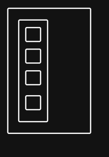
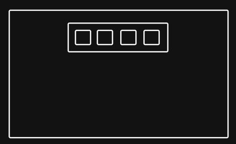
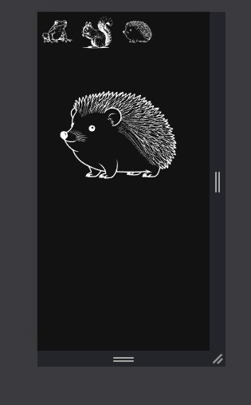
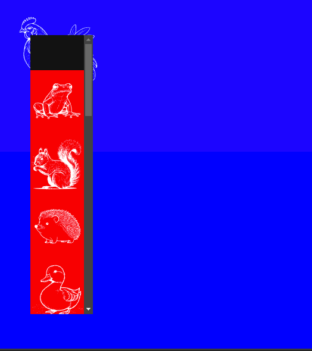
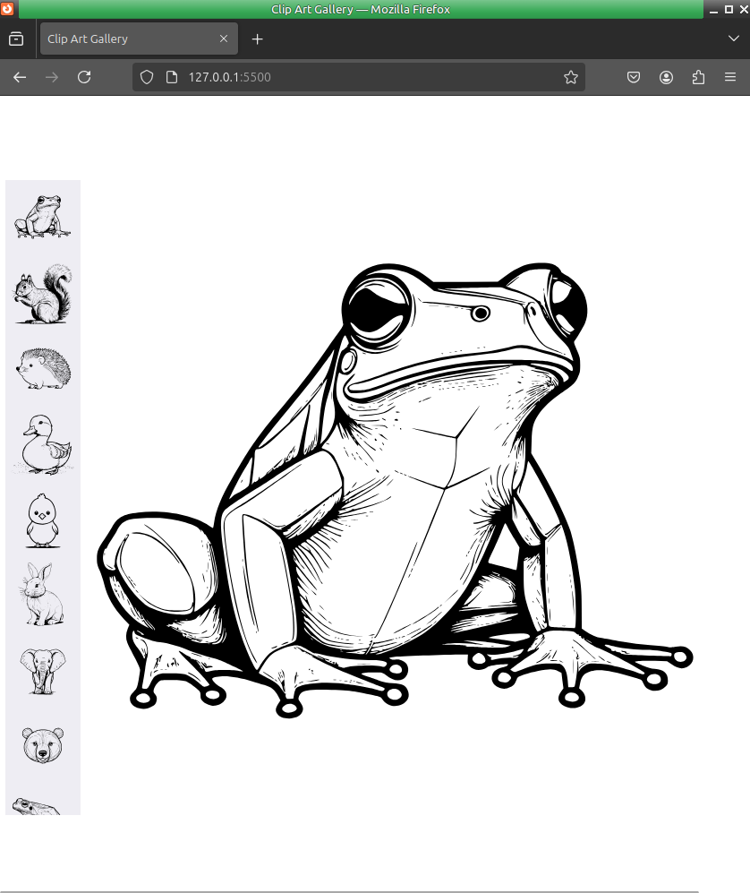

# Week-02-assignment

An accessible image gallery following a mobile-first approach and responsive design principles.

- created a rough plan in text file to keep me sane its included in the repo for assessors entertainment.

- dug out some clip art files I created as bitmapped images using an AI generator last year, the original images were ( back then not now )then converted with a fair bit of curation using python scripts into svg format that I am using today, svg gives be two advantages 1. they are very small in size and 2. they scale to any size so I can avoid all the work of creating different resolutions.

  I did a quick ls>namelist.txt in the media directory to make creating the array I need later faster.

Created two wire frames one for mobile

the other for desktop

- so far so good no hurdles other than using the http link to clone the repo - fixed.

---

Checkpoint 2025 05 10 1310

I now have functionality, clicking a thumbnail will change the background image (its not a background yet - CSS to come)

---

Checkpoint 2025 05 10 1546

Really struggling with the CSS I have managed to get the thumbnails element to the sit on top of the background element and I seem to be able to place it on the screen where I want it, getting the result and understanding how I got the result are yet to be friends - more time needed after a break.

---

Checkpoint 2025 05 11 1000

I really got lost in the weeds trying to keep dark mode and light mode looking how I want - I have abandoned this for now and expect the browser to be using no or light mode. - lesson learned I should have focused on the requirements, as a dark mode user I got distracted, using alternative 'normal' browser for assignments from now on.

Requirements

- Its responsive, but not in the way I want
- I have alt text for all the images
- I have event handlers that work fine with a mouse on a desktop, but tabbing the page fails at this time

---

Checkpoint 2025 11 1329

I have finally managed to get the thumbnail bar working, I have added a border to the currently selected thumbnail, this will change with both clicks and arrow key presses.

The CSS is still ugly as hell and thats what I'll work on next.

---

Final Thoughts:

The objectives:

- responsive design: I am now happy with the result
- Alt text: I'm not going to win any prises but they have all be added.
- Event handlers: I guess I got this right as the page is doing what I wanted it to do. I will not be surprised if I failed best practices!

I moved the location of the thumbnail bar for desktop sizes to the bottom of the screen the wire frame plan had it placed it at the top.

Another issue the published page on github does not include all the images, they are all present and work correctly locally.

The images were all created by me with AI assistance some time late last year (I have over 2300) as bitmaps and I wrote python scripts to convert them to SVG's and give them all the same size, in reflection, this made this assignment a little easier because image download times and scaling benefit from SVG format.

More I could have (will do later after assignment marking) done, the thumbnail bar needs to center the active item, on screen resizing it can disappear.

unresolved issue - when the screen is over a certain size I can no longer tab into the thumbnail bar, I suspect this will be a tab order issue.

---
