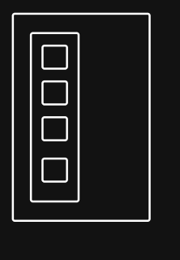
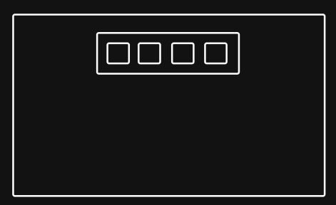

# Week-02-assignment

An accessible image gallery following a mobile-first approach and responsive design principles.

- created a rough plan in text file to keep me sane its included in the repo for assessors entertainment.

- dug out some clip art files I created as bitmapped images using an AI generator last year, the original images were ( back then not now )then converted with a fair bit of curation using python scripts into svg format that I am using today, svg gives be two advantages 1. they are very small in size and 2. they scale to any size so I can avoid all the work of creating different resolutions.

  I did a quick ls>namelist.txt in the media directory to make creating the array I need later faster.

Created two wire frames one for mobile

the other for desktop

- so far so good no hurdles other than using the http link to clone the repo - fixed.
